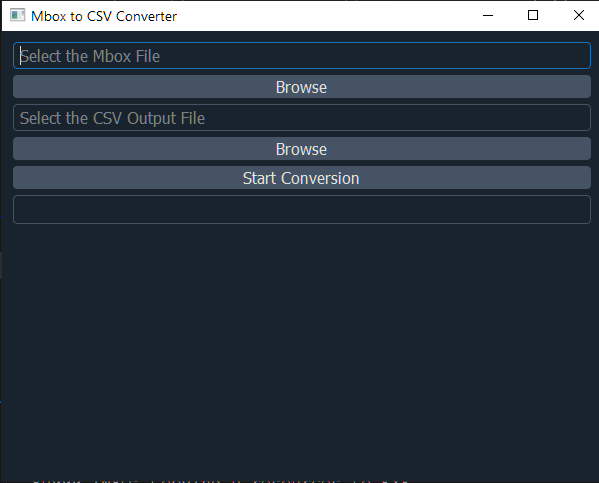

# Mbox to CSV Converter with PyQt5 GUI

A Python-based tool to efficiently convert `.mbox` email files into `.csv` format. This project includes a modern GUI built with PyQt5, optimized for performance with multi-threading and progress tracking.
#### You can download the Software from the [Releases](https://github.com/Quantlight/Mbox-to-csv-gui/releases/tag/Latest) Panel. No Installation of the Python is needed.

## Features

- **Mbox to CSV Conversion**: Convert `.mbox` email files to `.csv` format, extracting key information such as Date, Sender, Recipient, Subject, and Body.
- **Modern and Responsive GUI**: The interface is built using PyQt5, offering a sleek, Material Design-inspired dark theme with smooth animations and transitions.
- **File Selection Dialog**: Browse and select mbox input and CSV output files through the GUI.
- **Real-Time Progress Tracking**: A progress bar is provided to track the conversion process.
- **Error Handling**: The GUI provides real-time error messages, including any issues with file paths or conversion errors.
- **Optimized Performance**: Conversion is sped up using multi-threading (via `ThreadPoolExecutor`), handling large mbox files efficiently.
- **Cross-Platform Compatibility**: Works on Windows, macOS, and Linux.

## Screenshots



## Requirements

- Python 3.6 or higher
- PyQt5 (for GUI)
- qdarkstyle (for Material Design theme)
- mailbox (Python standard library)
- csv (Python standard library)

### Install Dependencies

To install the required dependencies, you can use `pip`. Run the following command:

```bash
pip install PyQt5 qdarkstyle
